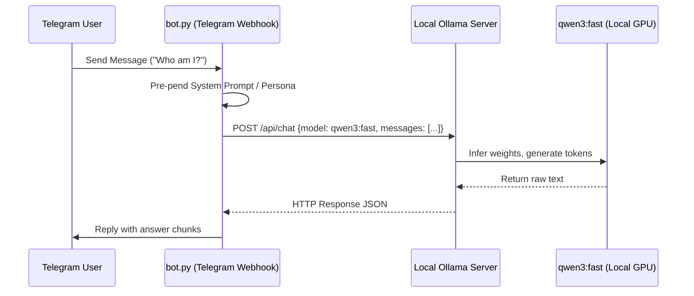
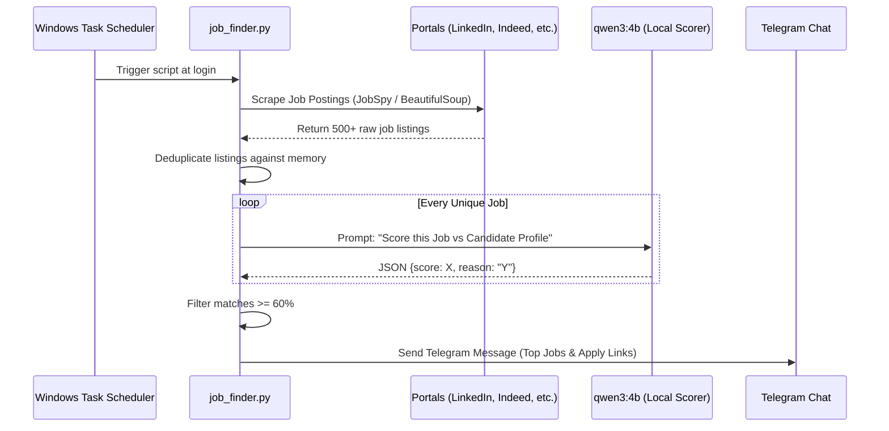

# Data Flow Diagrams

This document explains how data moves through the ARIA system sequentially.

## 1. Daily Assistant (Chatting) Flow

```mermaid
sequenceDiagram
    participant User as Telegram User
    participant Bot as bot.py (Telegram Webhook)
    participant Ollama as Local Ollama Server
    participant Model as qwen3:fast (Local GPU)

    User->>Bot: Send Message ("Who am I?")
    Bot->>Bot: Pre-pend System Prompt / Persona
    Bot->>Ollama: POST /api/chat {model: qwen3:fast, messages: [...]}
    Ollama->>Model: Infer weights, generate tokens
    Model-->>Ollama: Return raw text
    Ollama-->>Bot: HTTP Response JSON
    Bot->>User: Reply with answer chunks
```

## 2. Job Finder Automation Flow

```mermaid
sequenceDiagram
    participant Scheduler as Windows Task Scheduler
    participant JobFinder as job_finder.py
    participant Web as Portals (LinkedIn, Indeed, etc.)
    participant Ollama as qwen3:4b (Local Scorer)
    participant Telegram as Telegram Chat

    Scheduler->>JobFinder: Trigger script at login
    JobFinder->>Web: Scrape Job Postings (JobSpy / BeautifulSoup)
    Web-->>JobFinder: Return 500+ raw job listings
    JobFinder->>JobFinder: Deduplicate listings against memory
    
    loop Every Unique Job
        JobFinder->>Ollama: Prompt: "Score this Job vs Candidate Profile"
        Ollama-->>JobFinder: JSON {score: X, reason: "Y"}
    end

    JobFinder->>JobFinder: Filter matches >= 60%
    JobFinder->>Telegram: Send Telegram Message (Top Jobs & Apply Links)
```
