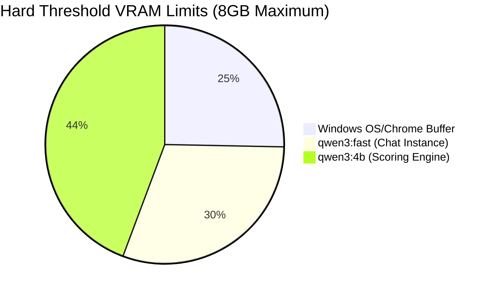

# 📊 ARIA: Data & Control Flow Diagrams

The following charts outline the strict sequences in which Data payloads move across the GPU limits and Web boundaries without external dependency.

---

## Phase 1: Real-Time Assistant Chat Flow

This process occurs asynchronously anytime a message is sent over Telegram.

```mermaid
sequenceDiagram
    autonumber
    participant User as Remote User (Telegram)
    participant Tele as Telegram Servers
    participant Python as bot.py (Webhook Listener)
    participant OpenClaw as OpenClaw Container
    participant Ollama as Ollama API
    participant GPU as RTX 5050 (qwen3:fast)

    User->>Tele: text: "Summarize this paper"
    Tele->>Python: Event Trigger: on_message()
    Python->>OpenClaw: Post /chat (Inject text)
    
    rect rgb(20, 20, 30)
    Note over OpenClaw,GPU: Inference Pipeline
    OpenClaw->>OpenClaw: Load SOUL.md (Persona)
    OpenClaw->>OpenClaw: Prepend historical chat logs
    OpenClaw->>Ollama: POST /api/generate {model: fast, prompt}
    Ollama->>GPU: Load layers to VRAM (2.4GB)
    GPU-->>Ollama: Inference Tokens
    end
    
    Ollama-->>OpenClaw: Streaming HTTP Response
    OpenClaw-->>Python: Processed String
    Python->>Tele: send_message(reply)
    Tele->>User: Delivery
```

---

## Phase 2: Autonomous Job Scoring Pipeline

This process happens purely automatically based on the Windows Scheduler trigger limit.

```mermaid
sequenceDiagram
    autonumber
    participant OS as Windows Login Scheduler
    participant JobFinder as job_finder.py
    participant Web as Internet Portals (LinkedIn, Indeed)
    participant Memory as Local Cache
    participant Ollama as Ollama API
    participant GPU as RTX 5050 (qwen3:4b)

    OS->>JobFinder: Execute python script
    
    rect rgb(10, 30, 20)
    Note over JobFinder,Web: Step 1: Web Data Collection
    JobFinder->>Web: Parallel Requests (nlp engineer, ml engineer)
    Web-->>JobFinder: Raw HTML / JSON Payload (500+ items)
    end
    
    JobFinder->>JobFinder: Parse & Clean HTML -> Text
    
    JobFinder->>Memory: Check existing hashes (Company+Title)
    Memory-->>JobFinder: Return 213 novel posts
    
    rect rgb(40, 20, 20)
    Note over JobFinder,GPU: Step 2: Scoring Constraints
    loop For Every Unique Job
        JobFinder->>Ollama: POST /api/generate {prompt: Profile + JobText}
        Ollama->>GPU: Infer via qwen3:4b (3.5GB VRAM)
        GPU-->>Ollama: Return strict JSON
        Ollama-->>JobFinder: { "score": 88, "reason": "Match on PyTorch" }
    end
    end
    
    JobFinder->>JobFinder: Filter matches (Score >= 60%)
    JobFinder->>OS: Sort desc, Format Markdown
    JobFinder->>OS: Dispatch batch payloads explicitly to Telegram
```

---

## VRAM Context Allocation Diagram

*(If both models are kept in memory correctly via careful context window clipping, zero spillover occurs, preserving maximum Tokens/Sec).*
